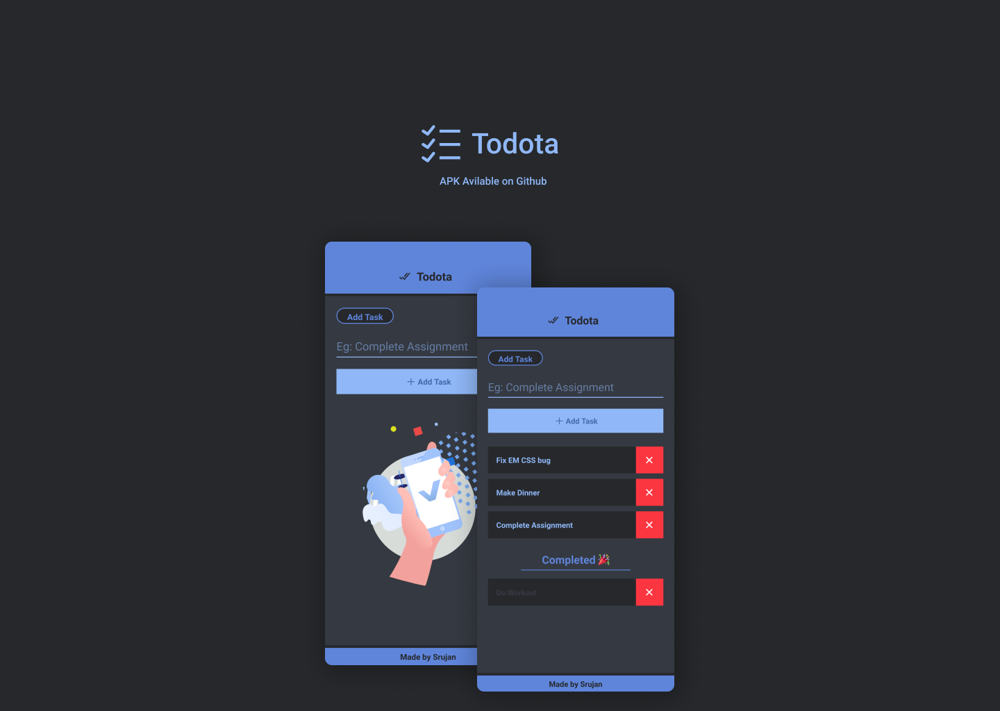

# Todota

A A simple Todo list app

🔗 **Link:** https://github.com/Royal-lobster/todota-reactnative/releases

[](https://github.com/tterb/atomic-design-ui/blob/master/LICENSEs) [](https://www.codefactor.io/repository/github/royal-lobster/covercons)

## Screenshots


  
## Installation

```bash
git clone https://github.com/Royal-lobster/Todota

cd Todota

npm install
```
## Running the Application

```bash
npm start
```
    
## Authors

- [@SrujanGurram](https://www.github.com/royal-lobster)

  
## License

[MIT](https://choosealicense.com/licenses/mit/)

  
